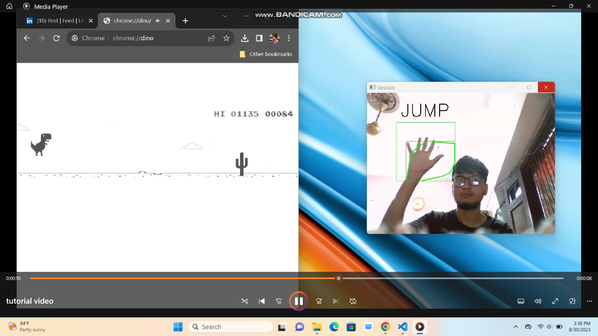

# Dino Game with Hand Signals




## Overview

This project allows you to play the popular Dino game using hand signals detected by a computer vision system. Instead of using the keyboard, you can control the game by making predefined hand gestures, making it a fun and interactive way to play the game.

## Table of Contents

- [Getting Started](#getting-started)
  - [Prerequisites](#prerequisites)
  - [Installation](#installation)
- [Video](#video)
- [Usage](#usage)
  - [Supported Hand Gestures](#supported-hand-gestures)
  - [Game Controls](#game-controls)
- [How It Works](#how-it-works)
  - [Computer Vision](#computer-vision)
  - [Game Integration](#game-integration)
- [Contributing](#contributing)

## Getting Started

### Prerequisites

Before you begin, ensure you have met the following requirements:

- Python 3.6 or later installed on your system.
- A webcam connected to your computer.
- Internet connection (for downloading dependencies).

## Video

1 [video](https://www.dropbox.com/scl/fi/anw6umof8j3lkqto5bhsi/tutorial-video.mp4?rlkey=cu5bq6l8rikwk6tw319gtr2gp&dl=0)

### Installation

1. Clone this repository to your local machine:

   ```shell
   git clone https://github.com/umairrrkhan/playing-chrome-dino-game-with-hand-signals.git
   ```
2. Run the main application:

```bash
jupyter notebook playing chrome dino with hand signals.ipynb
```
## Usage

Position yourself in front of your webcam so that your hand gestures are visible.

Make the predefined hand signals to control the Dino character (e.g., raise your hand to make the Dino jump).

Enjoy playing the Dino game using hand signals!

### Supported Hand Gestures

This project currently supports the following hand gestures:

- Jump: Raise your hand to make the Dino jump.
- Duck: Lower your hand to make the Dino crouch.

### Game Controls

Here's how the hand gestures map to game controls:

- Jump Gesture: The Dino will jump when you raise your hand above a certain threshold.
- Duck Gesture: Lowering your hand below a certain threshold will make the Dino crouch.

## How It Works

### Computer Vision

This project uses computer vision techniques to detect and recognize predefined hand gestures. It leverages the OpenCV library for capturing video from your webcam and analyzing each frame. The computer vision model is trained to recognize specific hand positions and movements to trigger game actions.

### Game Integration

The game screen is monitored using the webcam, and the computer vision model processes the video feed in real-time. When it recognizes a specific hand gesture, it sends the corresponding command to the Dino game to control the Dino's actions.

## Contributing

Contributions to this project are welcome. To contribute:

- Fork the repository.
- Create a new branch for your feature or bug fix.
- Make your changes and commit them.
- Push your changes to your fork.
- Open a pull request, describing your changes in detail.
